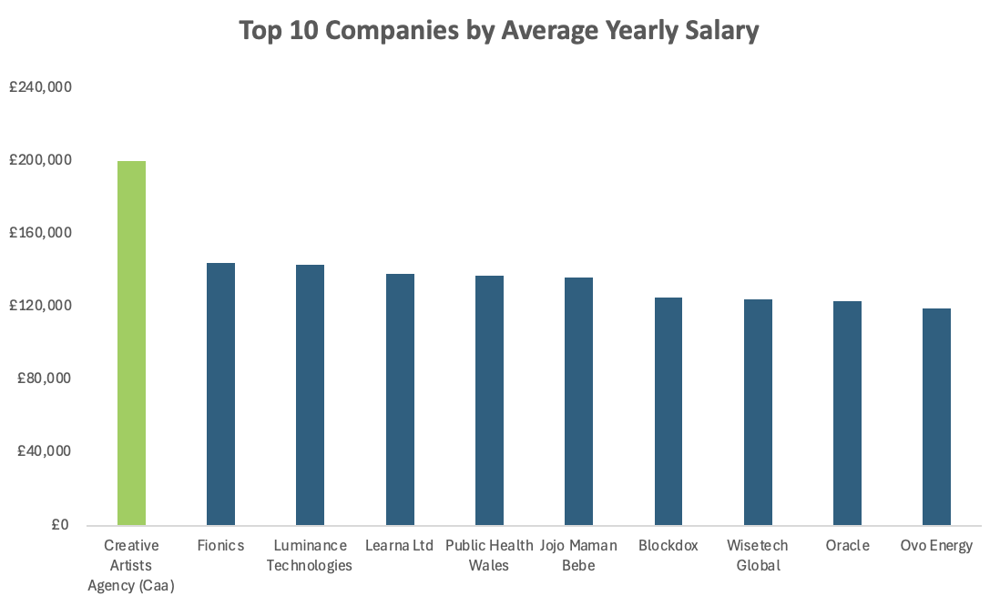

# 📉 UK Data Science Job Roles - 2024

## Project Overview
This is a simple exploratory data analysis project using widely available data on data science job postings in the UK from 2024, sourced from Kaggle:

🔗 Dataset: https://www.kaggle.com/datasets/emreksz/data-scientist-job-roles-in-uk/data

The main goal of this project is to demonstrate practical data cleaning and preprocessing skills using a combination of Power Query and Excel formulas, while preparing the dataset to answer key analytical questions about job trends and salaries in the data science field.

Questions:
- Which country has the highest and lowest average salary?
- Do remote jobs offer higher salaries compared to on-site roles?
- Which UK cities offer the highest and lowest paying roles on average?
- Which job categories are highest and lowest paying?
- What are the most common skills requested across all jobs?
- What are the top 10 companies in terms of average yearly salary?

## Tools Used
- Microsoft Excel
- Power Query
- Pivot Tables
- Charts and Data Visualisation
- Conditional Formatting

## Dataset Overview
This CSV file contains detailed information on data scientist job listings in UK sourced from Glassdoor. The dataset includes the following columns:

Company: Name of the hiring company.
Company Score: Average rating of the company on Glassdoor.
Job Title: Title of the job position.
Location: Job location.
Date: Date the job was posted or updated.
Salary: Estimated salary range for the position.
Skills:Skills required for the position

## Data Cleaning and Analysis Workflow

* Removed duplicate rows.
* Split the Location column into separate City and Country columns; cleaned and trimmed text.
* Standardised country names:
Midlothian → Scotland, County Durham → England, United Kingdom → Unknown
* Created a new column ‘Work Mode’ (Remote vs Onsite) using Power Query’s Conditional Column.
* Replaced ‘Remote’ with null in City and Country fields to prevent duplication or conflict.
* Cleaned the Salary column:
Removed special characters (K, text tags like "Glassdoor est.")
Removed hourly wage entries.
* Transformed salary ranges into single average values.
* Grouped job titles into broader categories (e.g., Data Scientist, Data Engineer, etc.) for better analysis.
* Added a new workbook where job skills were split into rows from a comma-separated column, enabling frequency analysis of requested skills across roles.
* Performed basic EAD using Pivot Rables to answer analytical questions

**See attached files for Uncleaned and Cleaned Data sets.**

## 💡 Insights

**Country - Salary**

Wales had the highest average salary across all job postings, while Scotland had the lowest.

**Remote and Onsite Jobs Offer Similar Average Salaries**

There was no significant difference in average salary between remote and onsite roles.

**Top and Bottom 10 Cities by Average Yearly Salary**

Cities like Brighton, Derby, and Preston offered the highest average salaries, while Redditch or Southhampton offered lower pay.

**Among the job roles:**

IT Architects had the highest average yearly salary. Data Engineers had the lowest.

**Most Commonly Requested Skills**

Machine Learning was the most common requested skill.

**Top 10 Companies Offering Highest Average Yearly Salary**

The following companies offered the highest salaries on average:

## What I Learned

- Clean and prepare raw data using Power Query (e.g., removing nulls, splitting columns, formatting values)
- Apply Excel formulas and conditional formatting for data transformation
- Perform exploratory data analysis (EDA) to uncover patterns, trends, and outliers
- Answer real-world questions using pivot tables
- Build clear and informative data visualisations using bar charts
- Draw data-driven insights and communicate them effectively with visual and written summaries
- Document my process through a structured GitHub portfolio

-----
-----

*Thank you for exploring my portfolio - Please do not hesitate to share your feedback as its invaluable in my learning journey.*

