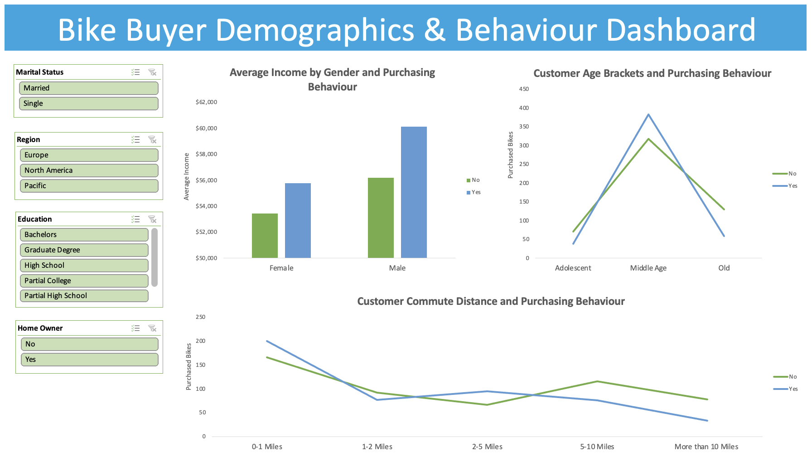

# Bike Buyers Demographics Analysis

## Project Overview
This is a guided simple data analysis project inspired by Alex the Analyst's tutorial:

🔗 https://www.youtube.com/watch?v=opJgMj1IUrc&list=PLUaB-1hjhk8Hyd5NiPQ9CND82vNodlFF5&index=7

The aim was to practice **data cleaning**, **basic data analysis** and **dashboard building** in Excel, using demographic data on individuals and their bike-buying behaviour. 

Questions:
- How does average income relate to bike purchase behaviour for males and females?
- What is the impact of commute distance on bike purchases? 
- Which age groups are more likely to purchase bikes? 

## Tools Used
- Microsoft Excel
- Pivot Tables
- Charts and Data Visualisation
- Slicers
- Interactive Dashboard 

## Dataset Overview
The dataset contains 1,026 rows of customer information, including: 

- **Demographics**: Gender, martial status, income, education, occupation, age
- **Household factors**: Home ownership, number of cars
- **Behavioural**: Commute distance, bike purchase (Yes/No)

## Data Cleaning and Analysis Workflow

* Removed 26 duplicate rows
* Replaced codes for descriptive values: 
- Married Status: M - Married, S - Single
- Gender: M - Male, F - Female
* Cleaned the Income column by removing decimal places
* Created new Age Bracket column using a nested IF formula:
- Adolescent <31
- Adult 31-54
- Old >54
* Standardised commute siatnce values

Pivot tables were used to prepare the dashboard:
- Gender, Average Income and Bike Purchase
- Commute Distance and Bike Purchase
- Age Bracket and Bike Purchase

**See attached files for Uncleaned and Cleaned Data sets.**

## 💡 Insights

**Income and Gender**

Both males and females with higher incomes were more likely to purchase a bike, though income difference between buyers and non-buyers was relatively small. 

**Commute Distance**

Customers with shortest commute distance (0-1 miles) were most likely to purchase a bike. 

**Age Brackets**

Individuals in the Middle Age bracket were significantly more likely to purchase a bike compared to other age groups.

## Dashboard

## What I Learned

- Remove duplicates and clean categorical data by replacing codes with descriptive values
- Apply Excel formulas (e.g., nested IF) to create new calculated columns
- Use Pivot Tables to analyse categorical and numerical data
- Build an interactive Excel dashboard with slicers and charts
- Identify and communicate demographic patterns in customer behaviour

-----

*Thank you for exploring my portfolio - Please do not hesitate to share your feedback as its invaluable in my learning journey.*

-----
